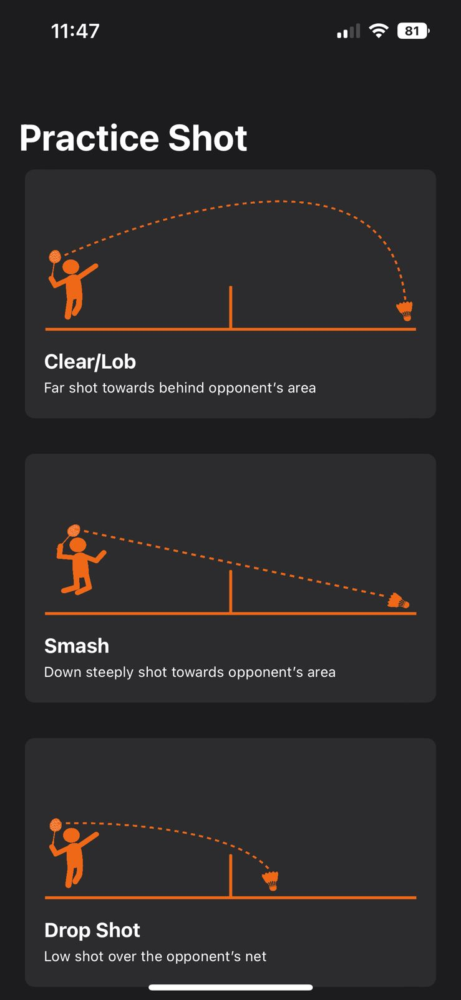
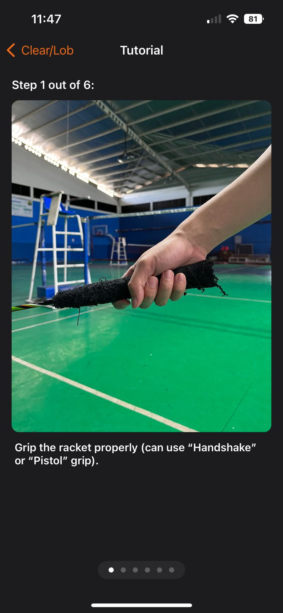
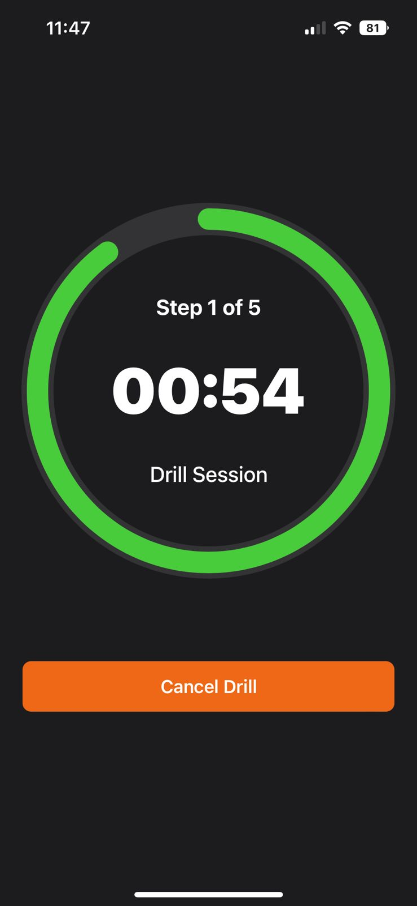
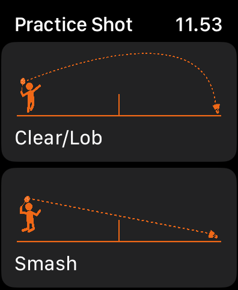
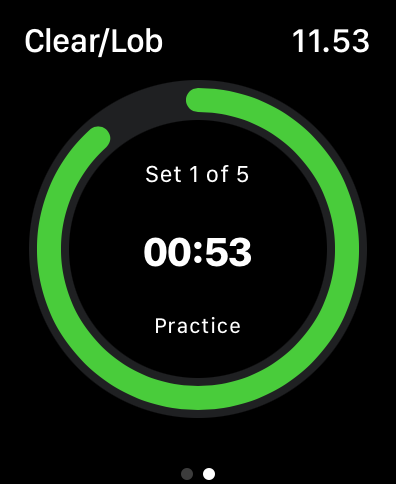
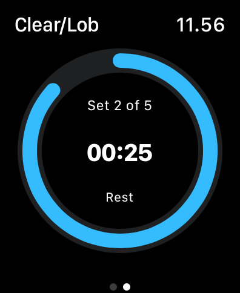

# Fineminton
Fineminton is an app for Badminton Player to to learn shot techniques.

## Tech Stack
**Platform:** iOS ``15.0`` 
**Framework:** SwiftUI, WatchKit 
**IDE:** XCode ``v.13.4`` 

## Screenshots iOS

   
  
  

## Screenshots WatchOS

   
   
   

## Team
Coder 
[Candra Winardi](https://github.com/cndrtan) 
[Theresia Saputri](https://github.com/trdsaputri) 
[Yoppy Yunhasnawa](https://github.com/yunhasnawa) 

Designer 
[Agnes Delicia Husada](https://www.instagram.com/agnesdelicia_/) 
[Ardian Kurniawan](https://github.com/Ardiankls) 
[Riska Saswono](https://www.instagram.com/rsaswono22/) 

## Feedback
If there any feedback, please reach me out at candra.winardi@gmail.com

## Notes
Mini Challenge 3 at Apple Developer Academy @ UC
